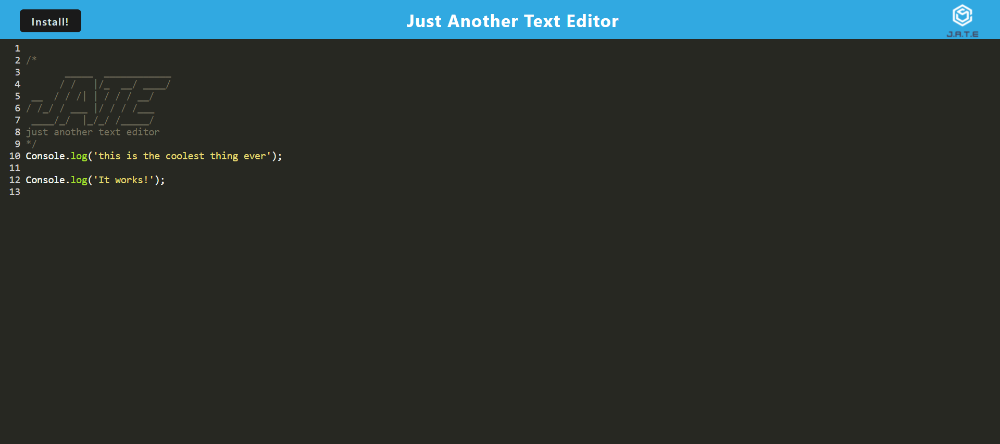

# Just Another Text Editor

  * [Description](#description)
  * [Installation](#installation)
  * [Languages used](#languages)
  * [Screen Shot](#screenshot)
  * [Heroku Link](#heroku-link)
  * [Questions](#email)
  
  
  ## Description 

  A text editor to allow you to save code snippets. You can install the app on your computer and use with or without internet. 

  ## Installation

  Clone the github repo onto your machine. Run 'npm install' and all the npm packages you need to run this app will be downloaded. Run 'npm run build' followed by 'npm start' and you can use and download the app. 

  ## Languages

  This app was created using:
  
  * webpack
  * javascript
  * node.js
  * indexedDB

  ## Screenshot
  

  ## Heroku link

  https://aqueous-lake-84441.herokuapp.com/

  ## Questions

  If you have any questions please contact me by email or GitHub.

  Email: marcotter25@yahoo.com

  GitHub: https://github.com/Rosepetal2022

